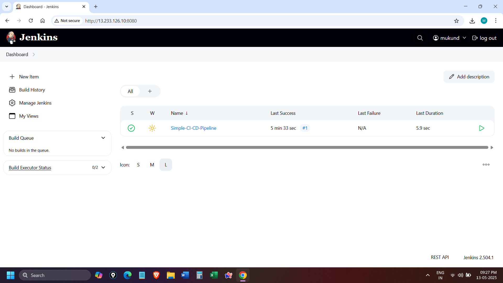

# Jenkins CI/CD Pipeline with Docker
## Task-2
---
This project demonstrates a simple CI/CD pipeline using Jenkins and Docker. It automates the process of building, testing, and deploying a static web application using Nginx.

## Project Structure

├── screenshots/ <br>
├── Dockerfile <br>
├── Jenkinsfile <br>
├── index.html <br>
└── README.md

- Dockerfile: Defines the Docker image, using Nginx to serve the static index.html.
- Jenkinsfile: Contains the Jenkins pipeline configuration.
- index.html: The static web page to be served.

## Setup Instructions

1. Clone the Repository:

   ```bash
   git clone https://github.com/mukund-p/jenkins-pipeline-task.git
   ```
2. Configure Jenkins:
- Create a new Jenkins pipeline project.
- In the pipeline configuration, set the pipeline script from SCM:
  - SCM: Git
  - Repository URL: `https://github.com/mukund-p/jenkins-pipeline-task.git`
  - Branch: main

3. Run the Pipeline:
- Trigger the pipeline build.
- Jenkins will execute the stages defined in the Jenkinsfile.

## Screenshots

### 1. Successful pipeline execution ###


---

### 2. Browser Showing Static Web App on Port 8081


---
### 3. Jenkins dashboard with pipeline listed



---
### 4. Docker image build logs


---

## Accessing the Application
**Access via**: `http://localhost:8081`

# 📘 Interview Questions & Answers – Jenkins CI/CD Pipeline

### 1. What is Jenkins, and how is it used in CI/CD?
**Jenkins** is an open-source automation server used to automate parts of software development, such as building, testing, and deploying.  
In a CI/CD workflow:
- Jenkins monitors version control systems (e.g., GitHub).
- When changes are detected, it triggers a build/test/deploy pipeline.
- This automation reduces manual effort, speeds up deployment, and ensures consistent delivery.

---

### 2. What is a Jenkinsfile?
A **Jenkinsfile** is a text file that contains the definition of a Jenkins pipeline.  
It is typically stored in the root of your project repository and allows Jenkins to run the pipeline as code.

Example:
```groovy
pipeline {
    agent any
    stages {
        stage('Build') {
            steps {
                echo 'Building...'
            }
        }
        stage('Test') {
            steps {
                echo 'Testing...'
            }
        }
        stage('Deploy') {
            steps {
                echo 'Deploying...'
            }
        }
    }
}
```

---

### 3. How do you create and configure Jenkins pipelines?
- **Step 1:** Install Jenkins and necessary plugins.
- **Step 2:** Create a new pipeline job in Jenkins.
- **Step 3:** Link your GitHub repo and use a Jenkinsfile from the repository.
- **Step 4:** Define pipeline stages in the Jenkinsfile (Build, Test, Deploy).
- **Step 5:** Set triggers (e.g., poll SCM, webhook) to automate runs.

---

### 4. What are some common stages in a Jenkins pipeline?
Common stages include:
- **Checkout:** Clone the repo
- **Build:** Compile code, create artifacts
- **Test:** Unit, integration, or end-to-end tests
- **Package:** Create deployable packages or Docker images
- **Deploy:** Push to a server or cloud provider (e.g., DockerHub, AWS)

---

### 5. What is the difference between a declarative and scripted Jenkins pipeline?
| Feature | Declarative Pipeline | Scripted Pipeline |
|--------|----------------------|--------------------|
| Syntax | Declarative (structured) | Groovy-based (flexible) |
| Readability | Easier for beginners | More powerful and customizable |
| Error Handling | Built-in | Requires manual scripting |
| Use Case | Standard CI/CD pipelines | Complex custom workflows |

Declarative example:
```groovy
pipeline {
    agent any
    stages {
        stage('Example') {
            steps {
                echo 'Hello World'
            }
        }
    }
}
```

Scripted example:
```groovy
node {
    stage('Example') {
        echo 'Hello World'
    }
}
```

